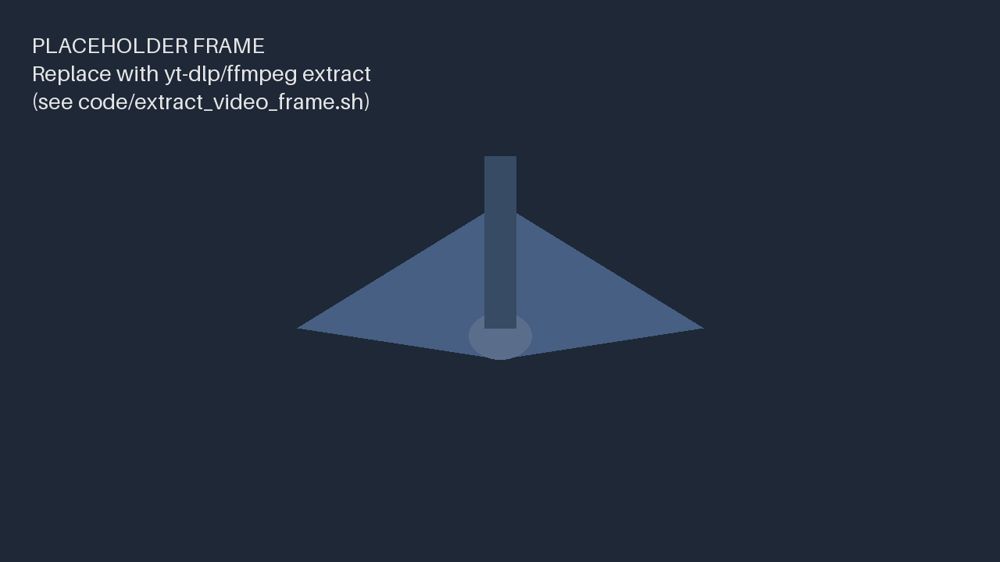

## Course Roadmap {.smaller}

::: {.incremental}
- Requirements and mission definition
- Aerodynamics and propulsion sizing
- Structures and weight budget
- Stability, control, and autopilot integration
- Build, test, and iterate
:::

## UAV Type Taxonomy

A map of common UAV configurations, from top-level airframe class down to
hybrid VTOL variants.

::: {.r-stack}
::: {.fragment .fade-in-then-out}
```{mermaid}
%%{init: {'theme':'base', 'themeVariables': {'primaryColor':'#eaf2fb','primaryTextColor':'#1b3a5c','primaryBorderColor':'#2a7de1','lineColor':'#1b3a5c','fontSize':'34px'}}}%%
graph TD
  UAV["UAV Types"] --> FW["Fixed-wing"]
  UAV --> RC["Rotor-craft"]
  UAV --> FL["Flapping"]
  UAV --> TS["Tail sitter"]
  UAV --> HY["Hybrid"]
```
:::

::: {.fragment .fade-in-then-out}
```{mermaid}
%%{init: {'theme':'base', 'themeVariables': {'primaryColor':'#eaf2fb','primaryTextColor':'#1b3a5c','primaryBorderColor':'#2a7de1','lineColor':'#1b3a5c','fontSize':'34px'}}}%%
graph TD
  UAV["UAV Types"] --> FW["Fixed-wing"]
  UAV --> RC["Rotor-craft"]
  UAV --> FL["Flapping"]
  UAV --> TS["Tail sitter"]
  UAV --> HY["Hybrid"]
  FW --> FW1["Tailless"]
  FW --> FW2["Swept forward"]
  FW --> FW3["Swept back"]
  RC --> RC1["Multicopter"]
  RC --> RC2["Single rotor"]
```
:::

::: {.fragment}
```{mermaid}
%%{init: {'theme':'base', 'themeVariables': {'primaryColor':'#eaf2fb','primaryTextColor':'#1b3a5c','primaryBorderColor':'#2a7de1','lineColor':'#1b3a5c','fontSize':'34px'}}}%%
graph TD
  UAV["UAV Types"] --> FW["Fixed-wing"]
  UAV --> RC["Rotor-craft"]
  UAV --> FL["Flapping"]
  UAV --> TS["Tail sitter"]
  UAV --> HY["Hybrid"]
  FW --> FW1["Tailless"]
  FW --> FW2["Swept forward"]
  FW --> FW3["Swept back"]
  RC --> RC1["Multicopter"]
  RC --> RC2["Single rotor"]
  HY --> HY1["Tilt-rotor"]
  HY --> HY2["Tilt-wing"]
```
:::
:::

## UAV Broad Use Areas {.smaller}

::: {.incremental}
- Gather Information
- Move things or people
- Entertain
- Harvest Energy
:::

## Video Walkthrough

::: {.video-wrap}
<iframe data-external="1" src="https://www.youtube.com/embed/bjYVOcS0qd8?start=0" title="UAV design walkthrough" frameborder="0" allow="accelerometer; autoplay; clipboard-write; encrypted-media; gyroscope" allowfullscreen></iframe>
:::

## Anatomy at a Glance

::: {.frame-wrap}
{.frame-img}

::: {.frame-overlay}
[]{.fragment .circle style="top: 36%; left: 56%; width: 10%; height: 16%;"}
[**Airframe** — carries the payload and absorbs flight loads]{.fragment .callout style="top: 8%; left: 2%;"}

[]{.fragment .box style="top: 34%; left: 44%; width: 10%; height: 32%;"}
[**Propulsion** — motor + prop, sized against drag and payload mass]{.fragment .callout style="top: 62%; right: 2%; left: auto; text-align: right;"}
:::
:::

::: {.notes}
Positions above are percentages of the image box (top/left/width/height),
so they stay aligned as the slide scales. media/video_frame.png is the
frame at 00:00:55 (see ../../scripts/extract_video_frame.sh) — the same
timestamp the previous slide's video stops at via its embed `end`
parameter. If you change that timestamp, re-run the extraction command
and adjust the percentages to land on whatever you're pointing at.
:::

## Next Lecture

Requirements definition and the mission specification document.
