## Course Roadmap {.smaller}

::: {.incremental}
- Requirements and mission definition
- Aerodynamics and propulsion sizing
- Structures and weight budget
- Stability, control, and autopilot integration
- Build, test, and iterate
:::

## UAV Broad Use Areas {.smaller .use-areas-slide}

::: {.use-areas-wrap}
::: {.use-areas-list}
[Gather Information]{.fragment .use-area-item data-fragment-index="1"}

[Move things or people]{.fragment .use-area-item data-fragment-index="2"}

[Entertainment]{.fragment .use-area-item data-fragment-index="3"}

[Flight Testing]{.fragment .use-area-item data-fragment-index="4"}

[Provide Service]{.fragment .use-area-item data-fragment-index="5"}

[Harvest Energy]{.fragment .use-area-item data-fragment-index="6"}
:::

::: {.use-area-collage}
::: {.use-area-tile .fragment data-fragment-index="1" style="top: 1%; left: 0%; width: 40%; height: 29%;"}
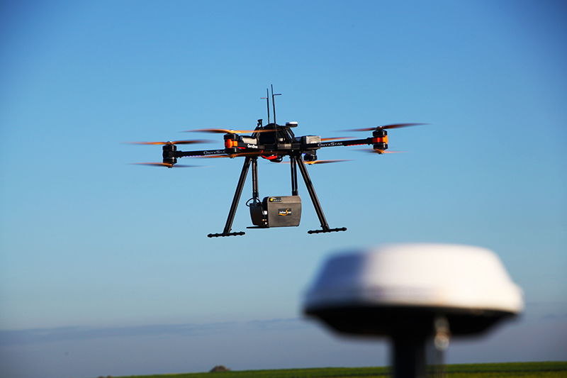{style="--img-scale: 1.3; --img-shift-x: 0%; --img-shift-y: -10%;"}
[Gather Information]{.use-area-caption}

::: {.use-area-info}
Co-axial quad-copter performaning a LIDAR ground survey.

[Source ↗](https://commons.wikimedia.org/wiki/File:Yellowscan_LIDAR_on_OnyxStar_FOX-C8_HD.jpg){target="_blank" rel="noopener"}
:::
:::

::: {.use-area-tile .fragment data-fragment-index="2" style="top: 1%; left: 51%; width: 30%; height: 32%;"}
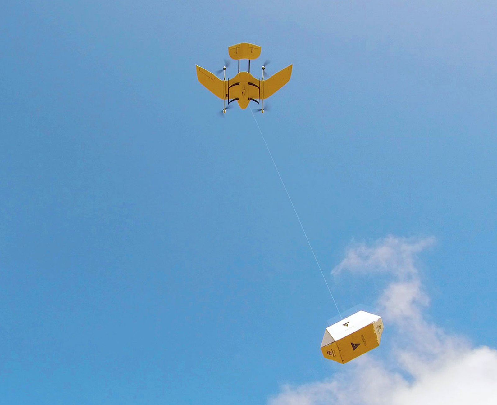{style="--img-scale: 1.2; --img-shift-x: 0%; --img-shift-y: 0%;"}
[Move things or people]{.use-area-caption}

::: {.use-area-info}
Wingcopter delivering vaccines in Vanuatu through its winch mechanism

[Source ↗](https://en.wikipedia.org/wiki/Wingcopter){target="_blank" rel="noopener"}
:::
:::

::: {.use-area-tile .fragment data-fragment-index="3" style="top: 34%; left: 0%; width: 45%; height: 29%;"}
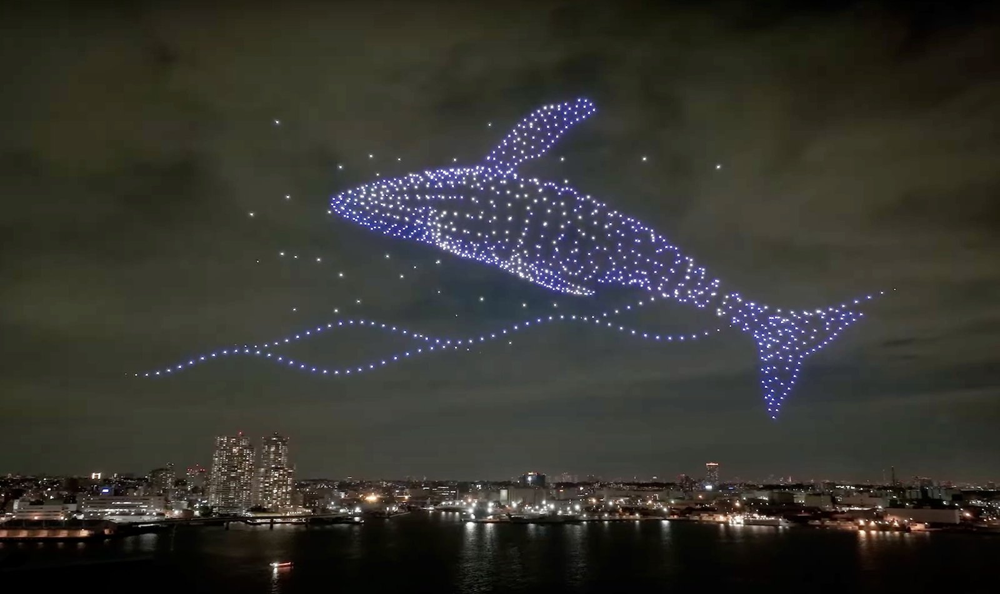{style="--img-scale: 1.4; --img-shift-x: -6%; --img-shift-y: -8%;"}
[Entertainment]{.use-area-caption}

::: {.use-area-info}
1000 Drone show in Japan

[Source ↗](https://commons.wikimedia.org/wiki/File:1000_drone_show_in_Japan_REDCLIFF.jpg){target="_blank" rel="noopener"}
:::
:::

::: {.use-area-tile .fragment data-fragment-index="4" style="top: 40%; left: 51%; width: 45%; height: 33%;"}
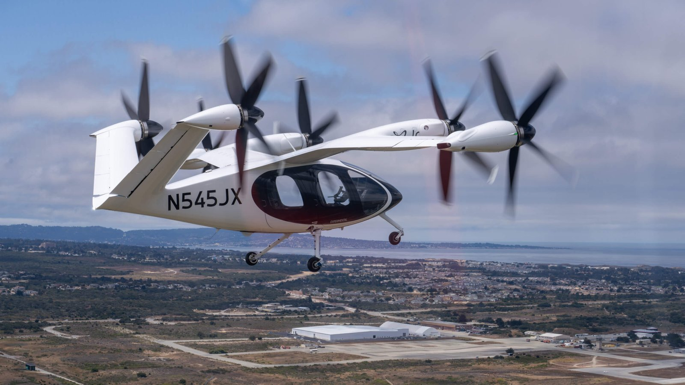{style="--img-scale: 1.1; --img-shift-x: 0%; --img-shift-y: 0%;"}
[Flight Testing]{.use-area-caption}

::: {.use-area-info}
Joby Aviation and most eVTOL players start flight testing through remote piloting.

[Source ↗](https://verticalmag.com/press-releases/joby-expands-manufacturing-capacity-in-california-and-ohio-adds-new-aircraft-to-its-fleet/){target="_blank" rel="noopener"}
:::
:::

::: {.use-area-tile .fragment data-fragment-index="5" style="top: 75%; left: 60%; width: 30%; height: 28%;"}
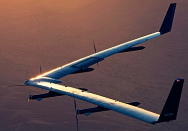{style="--img-scale: 1.1; --img-shift-x: 0; --img-shift-y: 0%;"}
[Provide Service]{.use-area-caption}

::: {.use-area-info}
Facebook Aquila high altitude psuedosatellite UAV intended to provide internet access in remote areas.

[Source ↗](https://en.wikipedia.org/wiki/Facebook_Aquila){target="_blank" rel="noopener"}
:::
:::

::: {.use-area-tile .fragment data-fragment-index="6" style="top: 67%; left: 0%; width: 49%; height: 32%;"}
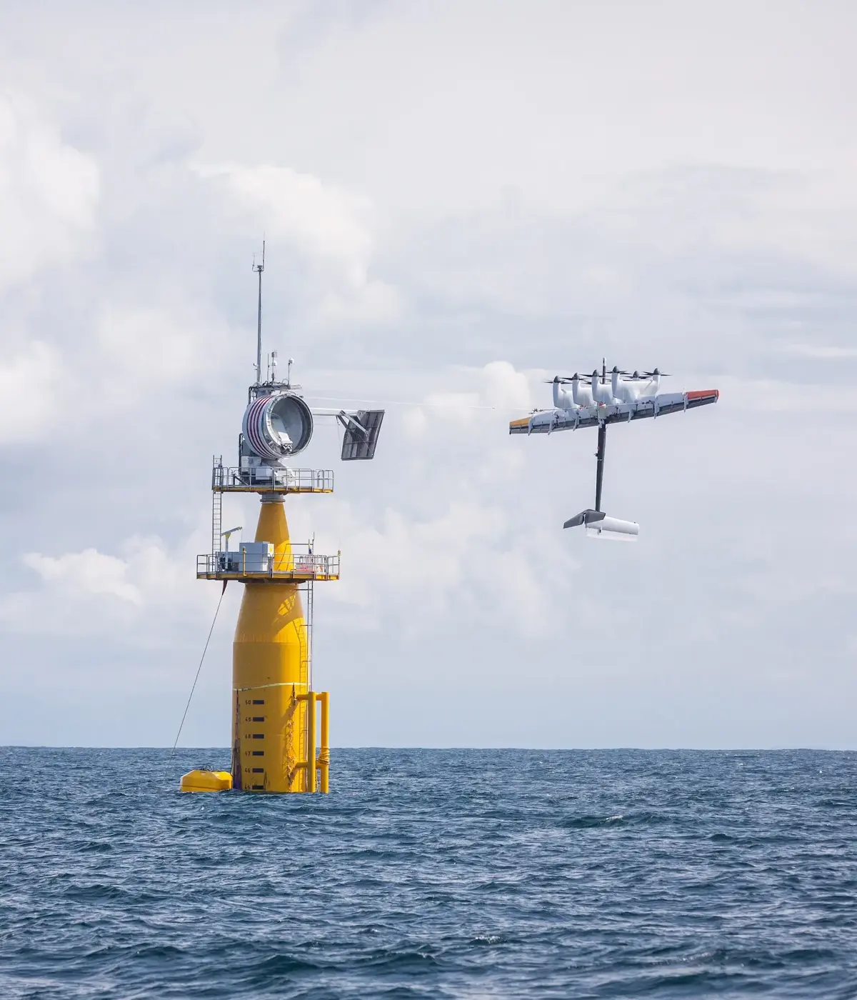{style="--img-scale: 1.4; --img-shift-x: -6%; --img-shift-y: -15%;"}
[Harvest Energy]{.use-area-caption}

::: {.use-area-info}
Makani was an wind harvesting UAV kite that would fly in loops to collect energy.

[Source ↗](https://x.company/projects/makani/){target="_blank" rel="noopener"}
:::
:::
:::
:::

::: {.notes}

:::

## UAV Market 2026 {.frame-wrap-slide}

::: {.frame-wrap style="--frame-width: 90%;"}
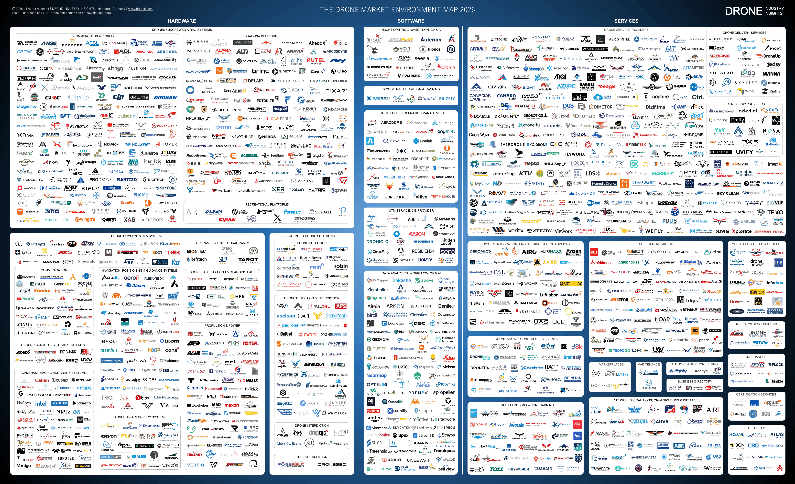{.frame-img}

::: {.frame-overlay}
::: {.fragment .fade-in-then-out}
[]{.box style="top: 8%; left: 1%; width: 43%; height: 40%; --shape-color: rgba(42, 157, 143, 0.85);"}
[**Focus of this class**]{.callout style="top: 17%; left: 42%; right: auto; text-align: right; --callout-line-color: rgba(42, 157, 143, 0.85);"}
:::

::: {.fragment .fade-in-then-out}
[]{.box style="top: 50%; left: 1%; width: 32%; height: 49%; --shape-color: rgba(42, 157, 143, 0.85);"}
[**Touched On**]{.callout style="top: 52%; left: 31%; right: auto; text-align: right; --callout-line-color: rgba(42, 157, 143, 0.85);"}
:::
[]{.fragment}
:::
:::

::: {.footer}
Alt+click the map to zoom in (Option+click on Mac, Ctrl+click on Linux)
:::

::: {.notes}

:::

## {.taxonomy-slide}

::: {.taxonomy-wrap}
<iframe data-external="1" src="media/uav-classification-interactive.html" title="UAV Classification Explorer"></iframe>
:::

## Zipline Platform 1

::: {.video-wrap}
<iframe data-external="1" src="https://www.youtube.com/embed/jEbRVNxL44c" title="Zipline Rewanda Opperations and Vehicle Design" frameborder="0" allow="accelerometer; autoplay; clipboard-write; encrypted-media; gyroscope" allowfullscreen></iframe>
:::

## Zipline Platform 1 Body {.frame-wrap-slide}

::: {.frame-wrap style="--frame-width: 95%;"}
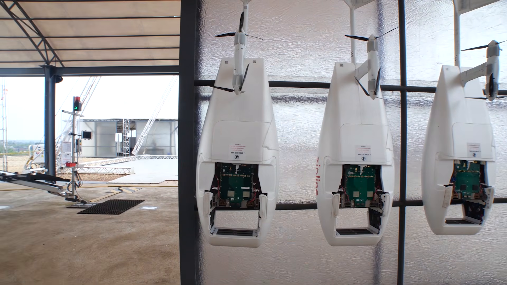{.frame-img}

::: {.frame-overlay}
[]{.fragment .circle style="top: 5%; left: 40%; width: 12%; height: 35%; --shape-color: rgba(42, 157, 143, 0.85);"}
[**Two Rotors** — The front rotor is always on but the rear rotor turns off and folds up during cruise.]{.fragment .callout style="top: 8%; left: 2%; --callout-line-color: rgba(42, 157, 143, 0.85);"}

[**Materials** — Everything is a low cost material on the airframe.]{.fragment .callout style="top: 62%; right: 2%; left: auto; text-align: right; --callout-line-color: rgba(42, 157, 143, 0.85);"}
:::
:::

## Zipline Platform 1 Modular Components {.frame-row-slide}

::: {.frame-row style="--frame-width: 95%;"}
::: {.frame-col style="--img-shift-x: 0%; --img-shift-y: 0%;"}
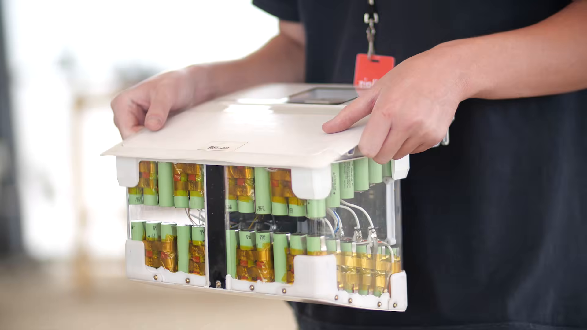

::: {.frame-overlay}
[**GPS Embedded in Battery** — The GPS is never powered down because it is always attached to the battery decreasing the change of a slow cold start.]{.fragment .callout style="top: 8%; left: 2%; max-width: 45%; font-size: 0.7em; --callout-line-color: rgba(42, 157, 143, 0.85);"}
:::
:::

::: {.frame-col}
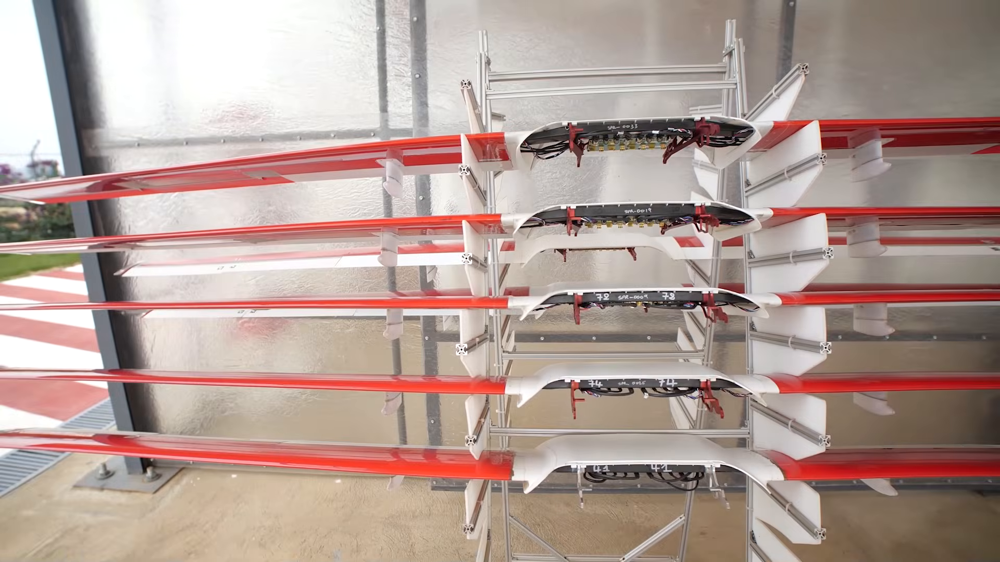
:::

::: {.footer}
The battery and wings are completely modular so that the wings can be easily replaced and that the batteries can be charged and cycled indepent of the body, decreasing turn around time.
:::
:::

## Zipline Platform 1 Launcher {.frame-wrap-slide}

::: {.frame-wrap style="--frame-width: 95%;"}
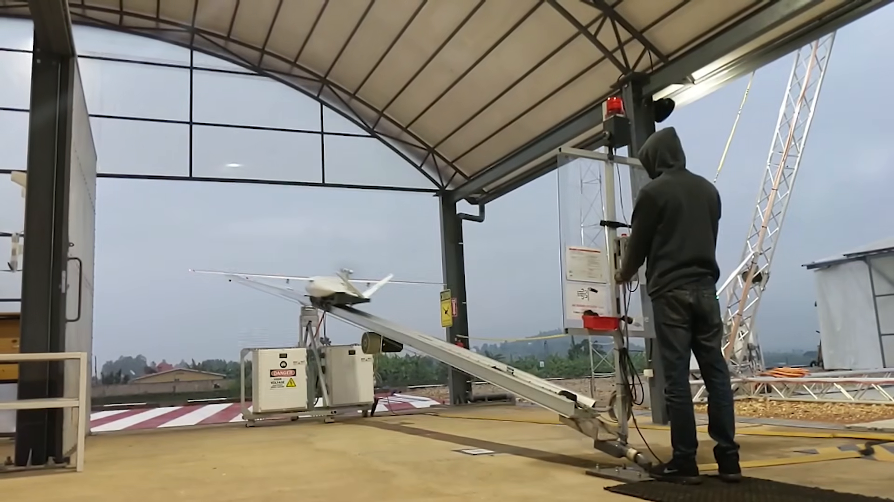{.frame-img}

::: {.footer}
The launcher allows for smaller rotors and thrust reducing the aircraft weight while also decreasing the footprint needed removing the need for a runway.
:::
:::

## Zipline Platform 1 Capture {.frame-row-slide}

::: {.frame-row style="--frame-width: 95%;"}
::: {.frame-col style="--img-shift-x: -50%; --img-shift-y: -20%;"}
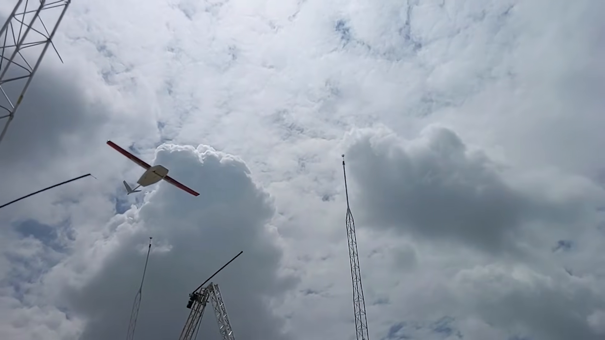
:::

::: {.frame-col}
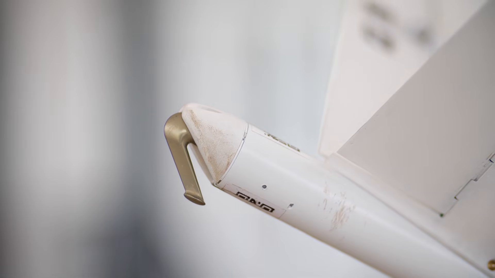
:::

::: {.footer}
The capture uses a hook on the tail of the UAV to hook the aircraft with a rope removing the need for landing gear on the UAV and decreasing the landing related damage. 
:::
:::

## Zipline Platform 2

::: {.video-wrap}
<iframe data-external="1" src="https://www.youtube.com/embed/airEzThGlx8?si=i1Jgf1N_WDGcGWkc" title="Zipline Platform 2" frameborder="0" allow="accelerometer; autoplay; clipboard-write; encrypted-media; gyroscope" allowfullscreen></iframe>
:::

## Zipline Platform 2 {.frame-wrap-slide}

::: {.frame-wrap style="--frame-width: 100%;"}
{.frame-img}

::: {.frame-overlay}
[]{.fragment .circle style="top: 2%; left: 30%; width: 22%; height: 23%; --shape-color: rgba(42, 157, 143, 0.85);"}
[]{.fragment .circle style="top: 28%; left: 20%; width: 22%; height: 23%; --shape-color: rgba(42, 157, 143, 0.85);"}
[]{.fragment .circle style="top: 15%; left: 60%; width: 21%; height: 22%; --shape-color: rgba(42, 157, 143, 0.85);"}
[]{.fragment .circle style="top: 38%; left: 50%; width: 20%; height: 20%; --shape-color: rgba(42, 157, 143, 0.85);"}
[**Quad Lift Rotors** ]{.fragment .callout style="top: 4%; left: 10%; max-width: 35%; --callout-line-color: rgba(42, 157, 143, 0.85);"}

[]{.fragment .circle style="top: 52%; left: 30%; width: 20%; height: 20%; --shape-color: rgba(42, 157, 143, 0.85);"}
[**Push Propeller**]{.fragment .callout style="top: 60%; left: 10%; text-align: Left; max-width: 25%; --callout-line-color: rgba(42, 157, 143, 0.85);"}

[]{.fragment .circle style="top: 78%; left: 40%; width: 15%; height: 24%; --shape-color: rgba(42, 157, 143, 0.85);"}
[**Delivery Droid**]{.fragment .callout style="top: 85%; left: 58%; text-align: Left; max-width: 45%; --callout-line-color: rgba(42, 157, 143, 0.85);"}
:::
:::

## Zipline Platform 2 {.frame-wrap-slide}

::: {.frame-wrap style="--frame-width: 100%;"}
{.frame-img}

::: {.frame-overlay}
[]{.fragment .circle style="top: 13%; left: 18%; width: 8%; height: 10%; --shape-color: rgba(210, 74, 69, 0.85);"}
[]{.fragment .circle style="top: 0; left: 38%; width: 6%; height: 8%; --shape-color: rgba(210, 74, 69, 0.85);"}
[]{.fragment .circle style="top: 15%; left: 70%; width: 4%; height: 7%; --shape-color: rgba(210, 74, 69, 0.85);"}
[]{.fragment .circle style="top: 38%; left: 70%; width: 8%; height: 10%; --shape-color: rgba(210, 74, 69, 0.85);"}
[]{.fragment .circle style="top: 13%; left: 50%; width: 10%; height: 8%; --shape-color: rgba(210, 74, 69, 0.85);"}
[**Acoustic Detect and Avoid Microphones** - Used to "hear" large aircraft and avoid them ]{.fragment .callout style="top: 80%; left: 60%; max-width: 35%; --callout-line-color: rgba(210, 74, 69, 0.85);"}

:::
:::

## Zipline Platform 2 Take-off and Langing Structure {.frame-wrap-slide}

::: {.frame-wrap style="--frame-width: 95%;"}
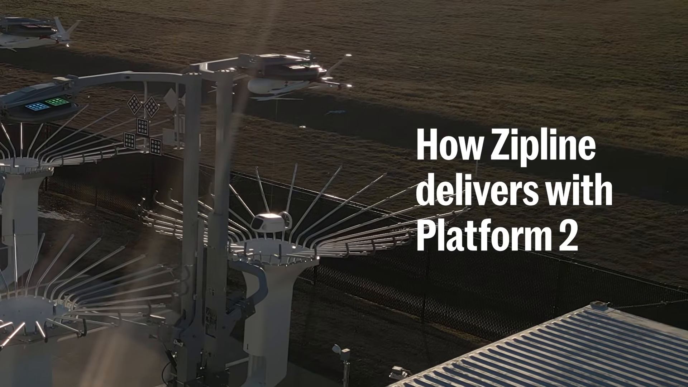{.frame-img}

::: {.frame-overlay}
[]{.fragment .circle style="top: 12%; left: 30%; width: 22%; height: 15%; --shape-color: rgba(42, 157, 143, 0.85);"}
[**Latching Dock** — Dock latches to the top of the UAV to allow droid to descend]{.fragment .callout style="top: 10%; left: 55%; max-width: 35%; --callout-line-color: rgba(42, 157, 143, 0.85);"}

[]{.fragment .circle style="top: 22%; left: 15%; width: 11%; height: 20%; --shape-color: rgba(42, 157, 143, 0.85);"}
[**Fiducials** — Used to localize the UAV]{.fragment .callout style="top: 5%; left: 2%; left: auto; text-align: Left; max-width: 25%; --callout-line-color: rgba(42, 157, 143, 0.85);"}

[]{.fragment .circle style="top: 43%; left: 19%; width: 50%; height: 27%; --shape-color: rgba(42, 157, 143, 0.85);"}
[**Droid Catch** — Large funnel for the droid]{.fragment .callout style="top: 75%; left: 50%; left: auto; text-align: Left; max-width: 45%; --callout-line-color: rgba(42, 157, 143, 0.85);"}
:::
:::

## Zipline Platform 2 Droid Loading/Delivery {.frame-row-slide}

::: {.frame-row style="--frame-width: 95%;"}
::: {.frame-col style="--img-shift-x: 0%; --img-shift-y: -20%;"}
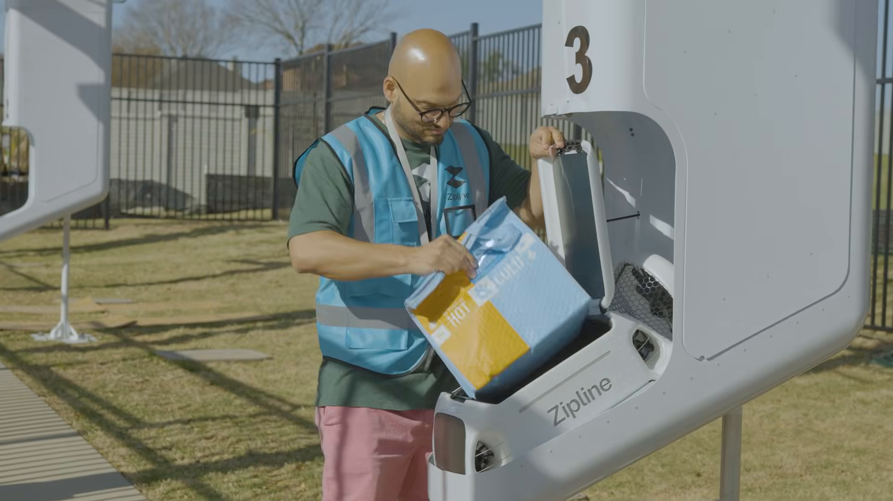
:::

::: {.frame-col}
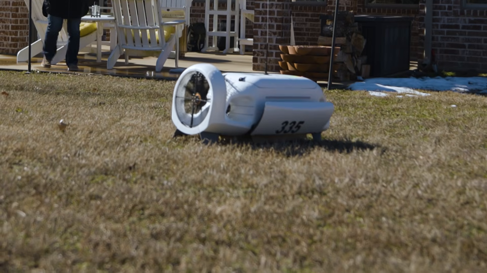
:::

::: {.footer}
The droid is loaded from the top and delivers from the bottom. 
:::
:::

## Zipline Comparison {.smaller}

<!--
  Tune the table's sizing here instead of in styles/custom.scss — every
  property below has a default baked into that file's `.compare-wrap`
  rule (see the comment there), this `style` attribute just overrides
  them for this one slide:

    --compare-width         overall table width (default 96%)
    --compare-label-width   left "spec name" column width (default 22%)
    --compare-col-gap       horizontal gap between the 3 columns (default 3%)
    --compare-row-gap       vertical gap between rows (default 0.05em)
    --compare-font-size     data-cell text size (default 0.4em)
    --compare-header-font-size  "Platform 1"/"Platform 2" label size (default 0.5em)
    --compare-img-width     header photo width, as % of its column (default 50%)
    --compare-img-height    header photo max-height in px (default 42px)
    --compare-bottom-margin space reserved below the table for the
                            `.footer` citation (default 3em) — the
                            `.footer` div is `position: fixed`, so it
                            claims no layout space of its own; shrink
                            this if you remove the footer, or keep it
                            generous if you make the table taller.

  Values below are larger than the file defaults and were re-checked by
  rendering + screenshotting the actual slide (not just eyeballed) —
  0.55em/70px was tried first and overflowed the last two rows into the
  `.footer` citation, and 0.46em/50px still clipped the last row, which
  is why these land where they do. This is the same headroom check
  you'll need to redo any time you push these further or add/remove
  rows: render, screenshot the slide, confirm the last row still clears
  the footer.
-->
::: {.compare-wrap style="--compare-width: 100%; --compare-label-width: 20%; --compare-font-size: 0.6em; --compare-header-font-size: 0.65em; --compare-img-width: 100%; --compare-img-height: 160px;"}
::: {.compare-row .compare-header}
::: {.compare-cell .compare-label}
:::
::: {.compare-cell}
{.compare-img}

Platform 1
:::
::: {.compare-cell}
{.compare-img}

Platform 2
:::
:::

::: {.compare-row}
::: {.compare-cell .compare-label}
Delivery Focus
:::
::: {.compare-cell}
Long-range deliveries for enterprise, business and government
:::
::: {.compare-cell}
Home delivery
:::
:::

::: {.compare-row}
::: {.compare-cell .compare-label}
Payload
:::
::: {.compare-cell}
4 pounds
:::
::: {.compare-cell}
8 pounds
:::
:::

::: {.compare-row}
::: {.compare-cell .compare-label}
Service Range
:::
::: {.compare-cell}
120+ miles roundtrip
:::
::: {.compare-cell}
10 miles service radius, or 24 miles one way
:::
:::

::: {.compare-row}
::: {.compare-cell .compare-label}
Cruise Speed
:::
::: {.compare-cell}
60 miles per hour
:::
::: {.compare-cell}
70 miles per hour
:::
:::

::: {.compare-row}
::: {.compare-cell .compare-label}
Delivery Area
:::
::: {.compare-cell}
About two parking spaces
:::
::: {.compare-cell}
Precise delivery to front yards, back yards, and even public parks and locations
:::
:::

::: {.compare-row}
::: {.compare-cell .compare-label}
Loading System
:::
::: {.compare-cell}
Orders packed by Zipline staff at distribution hubs
:::
::: {.compare-cell}
Easy-to-use Zipline Dropboxes to load and send orders
:::
:::

::: {.compare-row}
::: {.compare-cell .compare-label}
Delivery Mechanism
:::
::: {.compare-cell}
Parachute-controlled floating delivery from 60 - 80 feet above ground level
:::
::: {.compare-cell}
Tethered delivery from up to 300 feet above ground level
:::
:::

::: {.compare-row}
::: {.compare-cell .compare-label}
Integration
:::
::: {.compare-cell}
Hub-and-spoke model via standalone hubs
:::
::: {.compare-cell}
Hub-and-spoke model or long distance with dock-to-dock network charging
:::
:::

::: {.frame-overlay}
[]{.fragment .box style="top: 51%; left: 23%; width: 36%; height: 4%; --shape-color: rgba(210, 74, 69, 0.85);"}
[**Optimized for Distance** — The distance of the system was the most heavily weighted]{.fragment .callout style="top: 43%; left: 18%; max-width: 35%; --callout-line-color: rgba(210, 74, 69, 0.85);"}

[]{.fragment .box style="top: 60%; left: 63%; width: 36%; height: 7%; --shape-color: rgba(210, 74, 69, 0.85);"}
[**Optimized for Delivery Area** — Size of the required delivery zone was heavily weighted.]{.fragment .callout style="top: 69%; left: 60%; text-align: Left; max-width: 35%; --callout-line-color: rgba(210, 74, 69, 0.85);"}
:::
:::

::: {.footer}
Source: [Zipline Fact Sheet ↗](https://www.zipline.com/about/zipline-fact-sheet){target="_blank" rel="noopener"}
:::

## Skydio {.smaller}

::: {.compare-wrap .compare-no-label style="--compare-cols: 4; --compare-width: 100%; --compare-col-gap: 2%; --compare-font-size: 0.85em; --compare-header-font-size: 0.8em; --compare-img-height: 190px; --compare-bottom-margin: 0;"}
::: {.compare-row .compare-header}
::: {.compare-cell}
R1 (2018)
:::
::: {.compare-cell}
Skydio 2 (2019)
:::
::: {.compare-cell}
X2 (2021)
:::
::: {.compare-cell}
X10D (2023)
:::
:::

::: {.compare-row .compare-media}
::: {.compare-cell}
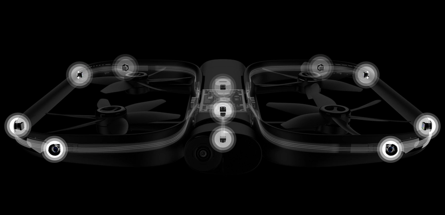{.compare-img}
:::
::: {.compare-cell}
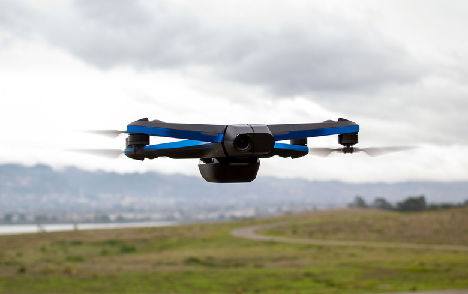{.compare-img}
:::
::: {.compare-cell}
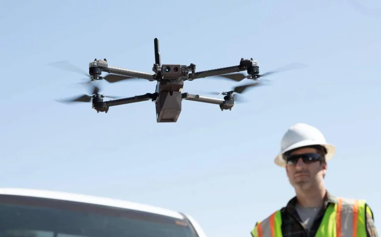{.compare-img}
:::
::: {.compare-cell}
{.compare-img}
:::
:::

::: {.compare-row}
::: {.compare-cell}
- Consumer "follow-me" camera drone
- 13 cameras: 12 for navigation + 1 4K camera
- NVIDIA Jetson TX1
- ~16 min flight
:::
::: {.compare-cell}
- Consumer, at a much lower price
- 6 × 200° fisheye navigation cameras
- NVIDIA Jetson TX2
- ~23 min flight
:::
::: {.compare-cell}
- Enterprise / defense, folding arms
- Visual + FLIR thermal camera
- Blue UAS approved
- ~35 min flight
:::
::: {.compare-cell}
- Defense variant of the X10
- 48 MP / 50 MP + FLIR thermal cameras
- NVIDIA Jetson Orin, night autonomy
- ~40 min flight
:::
:::
:::

## Amazon

## Bell Autonomous Pod Example

::: {.video-wrap}
<iframe data-external="1" src="https://www.youtube.com/embed/bjYVOcS0qd8?start=0" title="UAV design walkthrough" frameborder="0" allow="accelerometer; autoplay; clipboard-write; encrypted-media; gyroscope" allowfullscreen></iframe>
:::

## Anatomy at a Glance {.frame-wrap-slide}

::: {.frame-wrap}
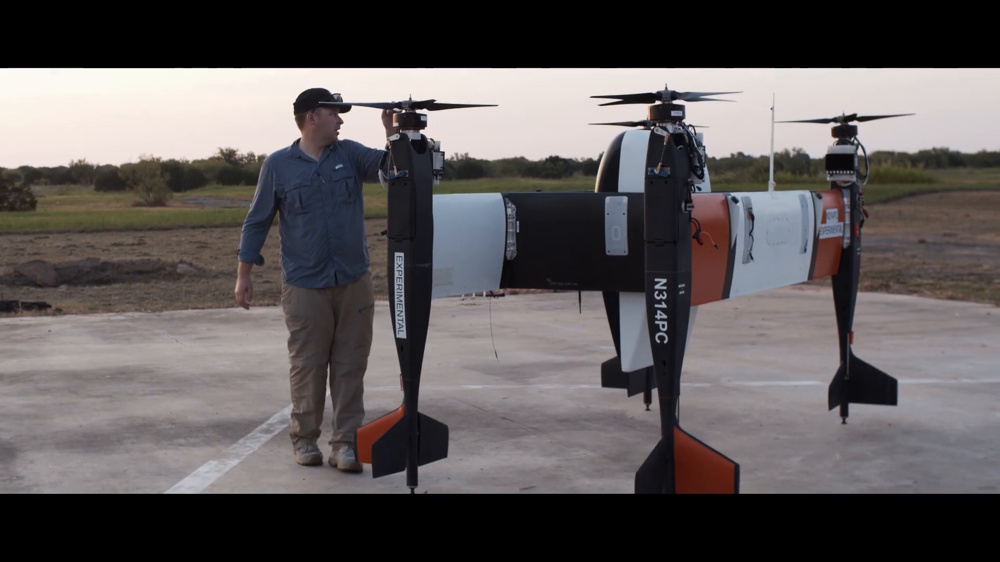{.frame-img}

::: {.frame-overlay}
[]{.fragment .circle style="top: 36%; left: 56%; width: 10%; height: 16%;"}
[**Airframe** — carries the payload and absorbs flight loads]{.fragment .callout style="top: 8%; left: 2%;"}

[]{.fragment .box style="top: 34%; left: 44%; width: 10%; height: 32%;"}
[**Propulsion** — motor + prop, sized against drag and payload mass]{.fragment .callout style="top: 62%; right: 2%; left: auto; text-align: right;"}
:::
:::

::: {.notes}
Positions above are percentages of the image box (top/left/width/height),
so they stay aligned as the slide scales. media/video_frame.png is the
frame at 00:00:55 (see ../../scripts/extract_video_frame.sh) — the same
timestamp the previous slide's video stops at via its embed `end`
parameter. If you change that timestamp, re-run the extraction command
and adjust the percentages to land on whatever you're pointing at.
:::

## Next Lecture

Requirements definition and the mission specification document.
