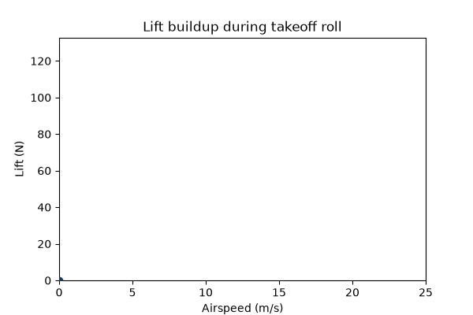

## Course Roadmap {.smaller}

::: {.incremental}
- Requirements and mission definition
- Aerodynamics and propulsion sizing
- Structures and weight budget
- Stability, control, and autopilot integration
- Build, test, and iterate
:::

## Why UAV Design Is an Iterative Loop

This slide demonstrates reveal.js **auto-animate**: the same element moves
between two slides to show progression through the design loop.

::: {data-id="loop-box"}
[Requirements]{.fragment}
:::

## The Loop Closes {auto-animate="true"}

::: {data-id="loop-box"}
[Requirements → Sizing → Analysis → Build → Test → back to Requirements]{style="font-size: 0.9em;"}
:::

## Lift Builds With Airspeed

A short animation generated by
`code/generate_lift_animation.py` and rendered to a GIF, showing lift
force during a takeoff roll for a small fixed-wing UAV.

{fig-align="center" width="70%"}

## Interactive: Wing Loading vs. Stall Speed

This slide uses Quarto's built-in Observable JS (OJS) support for a
live, in-browser interactive control — no external plugin required.

```{ojs}
//| echo: false
viewof clMax = Inputs.range([0.8, 2.0], {value: 1.4, step: 0.05, label: "CL max"})

rho = 1.225
g = 9.81

wingLoadings = d3.range(20, 200, 2)
stallData = wingLoadings.map(w => ({
  wingLoading: w,
  vStall: Math.sqrt((2 * w * g) / (rho * clMax))
}))

Plot.plot({
  x: {label: "Wing loading (N/m²)"},
  y: {label: "Stall speed (m/s)"},
  marks: [
    Plot.line(stallData, {x: "wingLoading", y: "vStall", stroke: "#2a7de1", strokeWidth: 3}),
    Plot.dot(stallData, Plot.pointerX({x: "wingLoading", y: "vStall", fill: "#1b3a5c"}))
  ],
  width: 700,
  height: 380
})
```

Adjust `CL max` above and watch the stall-speed curve update live —
this is the kind of interactive design-space exploration you'll build
your own versions of for later assignments.

## Supporting Code for This Lecture

::: {.callout}
`lectures/01-introduction/code/` holds the Python used to produce the
figures on these slides. Regenerate them with:

```bash
python lectures/01-introduction/code/generate_lift_animation.py
```
:::

## Next Lecture

Requirements definition and the mission specification document.
